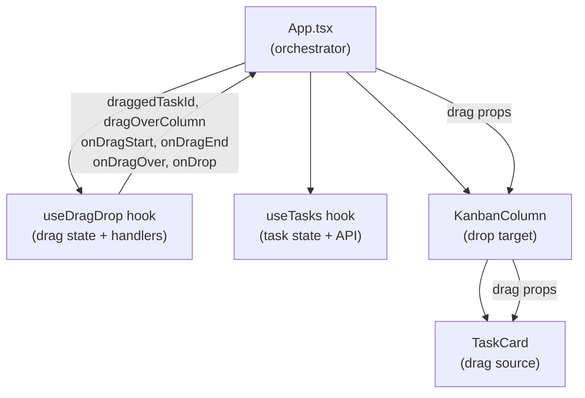
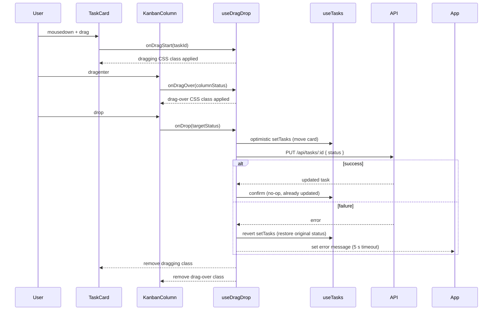

# Design Document: Kanban Drag and Drop

## Overview

This feature adds native HTML5 Drag and Drop support to the TaskFlow Kanban board. Users can drag a `TaskCard` from one column and drop it onto another to change the task's status. The implementation is purely frontend — no new backend endpoints are needed because the existing `PUT /api/tasks/:id` endpoint already accepts a `status` field.

The design follows an **optimistic UI** pattern: the card moves to the target column immediately on drop, and the API call happens in the background. If the call fails, the card reverts to its original column and an error message is shown.

Key constraints:
- No new npm dependencies — use the browser's native `DragEvent` API only.
- All existing card interactions (click, edit, delete, status-change button) must continue to work unchanged.
- Accessibility: cards must be announced as draggable; columns must be announced as drop targets.

---

## Architecture

The drag-and-drop state is managed centrally in `App.tsx` via a `useDragDrop` hook. This keeps `KanbanColumn` and `TaskCard` as presentational components that receive callbacks as props, consistent with the existing pattern.



### Event flow



---

## Components and Interfaces

### `useDragDrop` hook (new)

**File:** `frontend/src/hooks/useDragDrop.ts`

Encapsulates all drag-and-drop state and logic so `App.tsx` stays clean.

```typescript
interface UseDragDropOptions {
  tasks: Task[];
  setTasks: React.Dispatch<React.SetStateAction<Task[]>>;
  changeStatus: (id: number, status: Task["status"]) => Promise<void>;
  onError: (message: string) => void;
}

interface UseDragDropReturn {
  draggedTaskId: number | null;
  dragOverColumn: Task["status"] | null;
  inFlightTaskIds: Set<number>;
  onDragStart: (taskId: number, e: React.DragEvent) => void;
  onDragEnd: () => void;
  onDragOver: (status: Task["status"], e: React.DragEvent) => void;
  onDragLeave: () => void;
  onDrop: (targetStatus: Task["status"], e: React.DragEvent) => void;
}
```

Responsibilities:
- Track `draggedTaskId` and `dragOverColumn` in `useState`.
- Track `inFlightTaskIds` (a `Set<number>`) to prevent concurrent drops on the same task.
- On `onDragStart`: set `draggedTaskId`, write task id to `dataTransfer` as `text/plain`.
- On `onDrop`: read task id from `dataTransfer`, skip if same column or task is in-flight, apply optimistic update, call `changeStatus`, revert + call `onError` on failure.
- On `onDragEnd`: clear `draggedTaskId` and `dragOverColumn`.

### `KanbanColumn` changes

**File:** `frontend/src/components/KanbanColumn.tsx`

New props added:

```typescript
interface Props {
  // existing props unchanged ...
  isDragOver: boolean;
  onDragOver: (e: React.DragEvent) => void;
  onDragLeave: (e: React.DragEvent) => void;
  onDrop: (e: React.DragEvent) => void;
}
```

The `.kanban-column__cards` container gains:
- `onDragOver`, `onDragLeave`, `onDrop` event handlers.
- `aria-dropeffect="move"` attribute while a drag is in progress.
- Conditional `drag-over` CSS class when `isDragOver` is true.

### `TaskCard` changes

**File:** `frontend/src/components/TaskCard.tsx`

New props added:

```typescript
interface Props {
  // existing props unchanged ...
  isDragging: boolean;
  isInFlight: boolean;
  onDragStart: (e: React.DragEvent) => void;
  onDragEnd: (e: React.DragEvent) => void;
}
```

The `<article>` element gains:
- `draggable={true}` attribute.
- `onDragStart` and `onDragEnd` handlers.
- `aria-grabbed={isDragging}` attribute.
- Conditional `dragging` CSS class when `isDragging` is true (sets `opacity: 0.5`).
- `pointer-events: none` on action buttons during drag to prevent accidental button triggers.
- `isInFlight` disables `draggable` and dims the card while an API call is pending.

Action buttons (`onEdit`, `onDelete`, `onStatusChange`) retain `onClick` with `e.stopPropagation()` and are **not** given `draggable`, so clicks on them do not initiate a drag.

### `App.tsx` changes

- Instantiate `useDragDrop` and wire its return values to `KanbanColumn` and `TaskCard` props.
- Add an `errorMessage` state (`string | null`) with a 5-second auto-clear timeout.
- Render an error banner when `errorMessage` is set.

---

## Data Models

No new backend data models are required. The existing `Task` type and `PUT /api/tasks/:id` endpoint are sufficient.

### Drag state (frontend only, not persisted)

```typescript
// Held in useDragDrop hook state — never sent to the server
interface DragState {
  draggedTaskId: number | null;   // id of the card being dragged
  dragOverColumn: Task["status"] | null; // column currently hovered
  inFlightTaskIds: Set<number>;   // tasks with pending API calls
}
```

### Optimistic update pattern

When a drop occurs the hook applies this sequence to the `tasks` array:

1. **Snapshot** the current task's status as `previousStatus`.
2. **Optimistic write**: `setTasks(prev => prev.map(t => t.id === id ? { ...t, status: targetStatus } : t))`.
3. **API call**: `await changeStatus(id, targetStatus)`.
4. **On failure**: `setTasks(prev => prev.map(t => t.id === id ? { ...t, status: previousStatus } : t))` then call `onError(...)`.

---

## Correctness Properties

*A property is a characteristic or behavior that should hold true across all valid executions of a system — essentially, a formal statement about what the system should do. Properties serve as the bridge between human-readable specifications and machine-verifiable correctness guarantees.*

### Property 1: Drag start identifies the active drag source

*For any* task in the task list, when `onDragStart` is called with that task's id, the `draggedTaskId` in the drag state SHALL equal that task's id.

**Validates: Requirements 1.1**

### Property 2: Drag end without drop is a no-op

*For any* task list and any task id, calling `onDragStart` followed by `onDragEnd` without an intervening `onDrop` SHALL leave the task list unchanged and set `draggedTaskId` to null.

**Validates: Requirements 1.4**

### Property 3: Drag-over sets column highlight state

*For any* column status value, calling `onDragOver` with that status SHALL set `dragOverColumn` to that status value, regardless of which column the drag originated from.

**Validates: Requirements 2.1, 2.3**

### Property 4: Cross-column drop applies optimistic update immediately

*For any* task with status A and any target status B where B ≠ A, calling `onDrop` with target status B SHALL update the task's status in the local task list to B synchronously, before the API call resolves.

**Validates: Requirements 3.1, 4.1**

### Property 5: Same-column drop is a no-op

*For any* task dropped onto a column whose status equals the task's current status, the task list SHALL remain structurally identical and no call to `changeStatus` SHALL be made.

**Validates: Requirements 3.4**

### Property 6: API failure reverts optimistic update to original status

*For any* task with original status A that is optimistically moved to status B, if the API call fails, the task's status in the local task list SHALL be restored to A and the error callback SHALL be invoked with a non-empty message.

**Validates: Requirements 3.5, 4.2**

### Property 7: In-flight guard prevents concurrent drops on the same task

*For any* task id that is present in `inFlightTaskIds`, any subsequent `onDrop` call for that same task id SHALL leave the task list unchanged and SHALL NOT invoke `changeStatus`.

**Validates: Requirements 4.4**

---

## Error Handling

| Scenario | Behaviour |
|---|---|
| API call fails on drop | Revert optimistic update; show error banner for ≥ 5 seconds |
| Drop on same column | No API call; no state change |
| Drop outside any column | `dragend` fires; no state change |
| Drag while task is in-flight | Drop silently ignored |
| Network timeout | Treated as API failure — revert + error banner |

Error messages are surfaced via a top-level `errorMessage` state in `App.tsx`, rendered as a dismissible banner above the board. The banner auto-clears after 5 seconds via `setTimeout`.

---

## Testing Strategy

### Unit tests (example-based)

- `useDragDrop` hook: test `onDragStart` sets `draggedTaskId`; test `onDragEnd` clears state; test same-column drop is a no-op; test in-flight guard blocks second drop.
- `KanbanColumn`: test `drag-over` class is applied/removed based on `isDragOver` prop.
- `TaskCard`: test `dragging` class and `opacity` applied when `isDragging` is true; test action buttons still fire their handlers when clicked.

### Property-based tests

The feature's core logic — optimistic update, revert on failure, same-column no-op, in-flight guard — is pure state transformation logic that is well-suited to property-based testing. The recommended library is **[fast-check](https://github.com/dubzzz/fast-check)** (already compatible with Vitest, zero new runtime dependencies).

Each property test runs a minimum of **100 iterations**.

Tag format: `// Feature: kanban-drag-drop, Property {N}: {property_text}`

**Property 1 test** — drag start identifies the active drag source
Generate: random task list, random task id from the list.
Assert: after calling `onDragStart(taskId)`, `draggedTaskId` equals `taskId`.

**Property 2 test** — drag end without drop is a no-op
Generate: random task list, random task id.
Simulate: call `onDragStart(taskId)` then `onDragEnd()` without `onDrop`.
Assert: `draggedTaskId` is null and the task list is structurally identical to the input.

**Property 3 test** — drag-over sets column highlight state
Generate: random `Task["status"]` value.
Assert: after calling `onDragOver(status)`, `dragOverColumn` equals that status.

**Property 4 test** — cross-column drop applies optimistic update immediately
Generate: random task list, random task id, random target status ≠ task's current status.
Assert: synchronously after `onDrop(targetStatus)`, the task's status in the list equals `targetStatus`.

**Property 5 test** — same-column drop is a no-op
Generate: random task list, random task id.
Assert: calling `onDrop` with the task's current status leaves the task list structurally identical and `changeStatus` is not called.

**Property 6 test** — API failure reverts optimistic update to original status
Generate: random task list, random task id, random target status ≠ current status.
Simulate: apply optimistic update, then trigger the revert path (mock API failure).
Assert: the task's status in the final list equals its original status and `onError` was called with a non-empty string.

**Property 7 test** — in-flight guard prevents concurrent drops on the same task
Generate: random task id, random target status.
Simulate: add task id to `inFlightTaskIds`, then call `onDrop`.
Assert: the task list is unchanged and `changeStatus` is not called.

### CSS / visual tests

- Snapshot tests for `KanbanColumn` with `isDragOver={true}` and `isDragOver={false}`.
- Snapshot tests for `TaskCard` with `isDragging={true}` and `isDragging={false}`.

### Accessibility checks

- Manual test: verify `draggable="true"` and `aria-grabbed` are present on `TaskCard` in the rendered DOM.
- Manual test: verify `aria-dropeffect="move"` is present on column drop zones during a drag.
- Manual test: verify existing keyboard status-change buttons remain focusable and operable.
